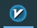
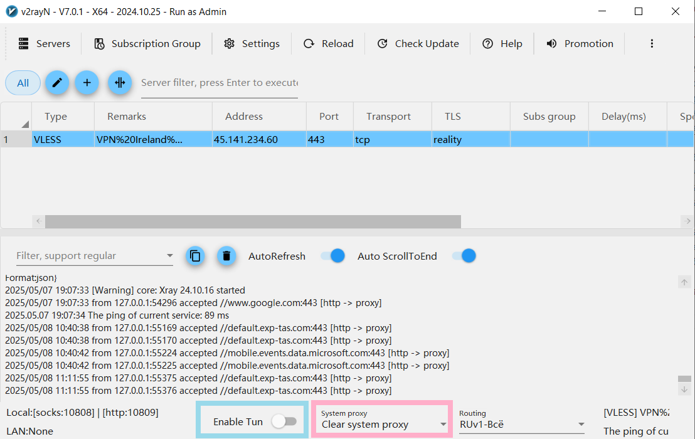
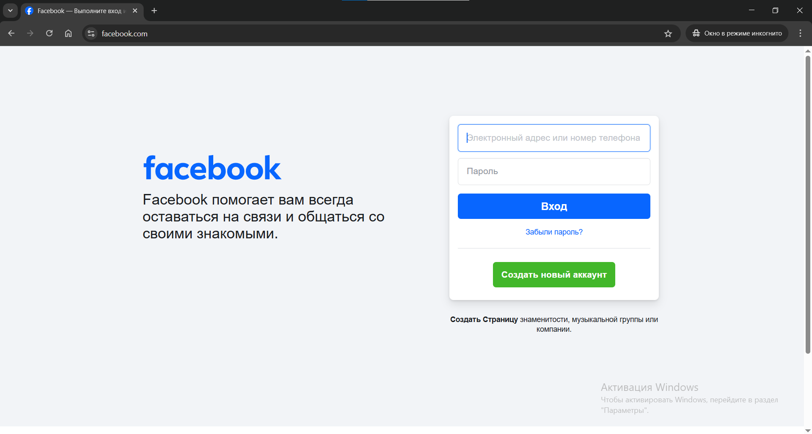

# VPN через Vless

## Что такое Vless

Vless - протокол общения через прокси-сервер. Твоё устройство направляет через прокси-сервер интернет-трафик. Прокси-сервером может быть любая страница - например, [kittenlady.org](https://www.kittenlady.org)

Ты обращаешься как будто к прокси-серверу, и получаешь информацию от него. Прокси-сервер направляет твои запросы к заблокированным сайтам, и отправляет ответ тебе. 

Провайдеры, Роскомнадзор и сисадмины думают, что ты общаешься с сервером. А ты на деле получаешь доступ к заблокированным сайтам - через прокси-сервер

## Клиент для Vless

Клиент - приложение, которое подключает устройство к прокси-серверу.

На Windows ты можешь использовать V2RrayN в качестве такого клиента. Найди его на рабочем столе или в панели задач, и включи:

*Значок V2rayN*

Тебе нужны две нижние кнопки в V2rayN: `Enable Tun` и `System Proxy`

*Кнопки `Enable Tun` и `System Proxy`*

## Подключение к прокси-серверу

Нажми на поле `System Proxy` и выбери `Set system  proxy`. После этого включи ползунок на поле `Enable Tun`

> Приложение при включении `Enable Tun` может перезагрузиться - тогда V2rayN следует включить ещё раз

Переключи ползунок `Enable Tun` 5-6 раз, с перерывами в несколько секунд. После этого проверь заблокированный сайт, например [facebook.com](https://www.facebook.com)

*Доступный сайт Facebook*
