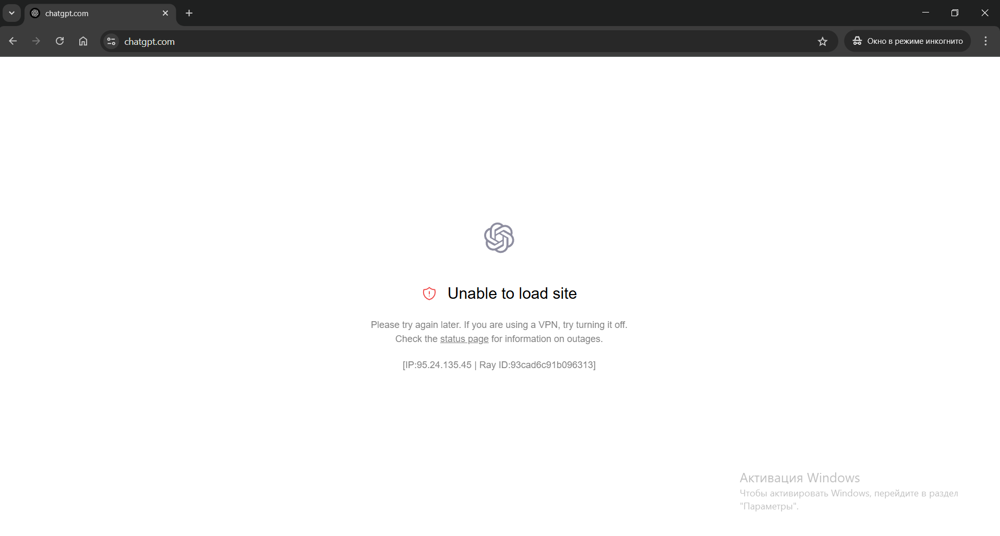
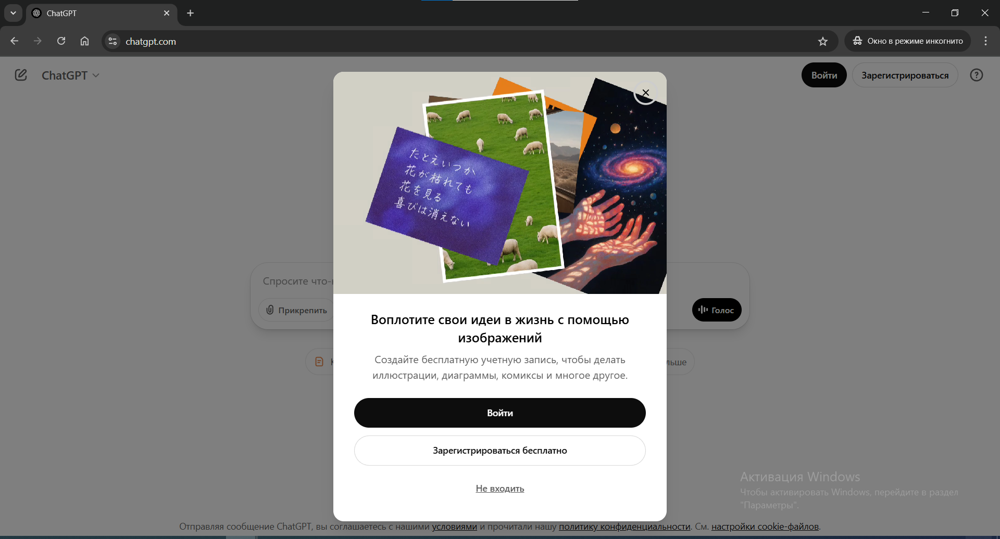
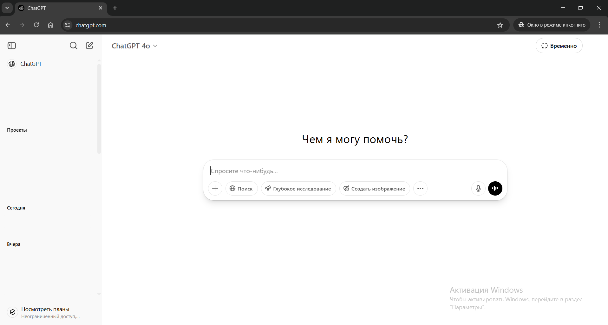

# Переход на ChatGPT

## Сайт ChatGPT

С включённым V2RayN перейди на **[chatgpt.com](https://chatgpt.com)**. 

### Доступа нет: проблемы с прокси

Если ты видишь `Unable to load site`, значит прокси не работает. Перейди в V2RayN и переключи пункт `System Proxy` на `Set system proxy` и обратно 5-7 раз. Время от времени в браузере нажимай `F5`, чтобы обновить страницу. Проверь, что в `System Proxy` указан именно `Set system proxy`, когда ты обновляешь страницу. Если после 10-20 `System Proxy` проблема останется, обратись ко мне: [@botrqst](https://t.me/botrqst)

*Ошибка Unable to load site*

### ChatGPT без авторизации

Если на главной странице **[chatgpt.com](https://chatgpt.com)** ты видишь кнопку "*Войти*", значит тебе нужно авторизоваться. Переходи к **Шагу 3: "Авторизация ChatGPT"**

*Главная страница ChatGPT без авторизации*

### ChatGPT с авторизацией

Если на главной странице **[chatgpt.com](https://chatgpt.com)** ты видишь авторизованный аккаунт и список диалогов, ты можешь пользоваться. Переходи к **Шагу 4: Использование ChatGPT**

*ChatGPT после авторизации*
