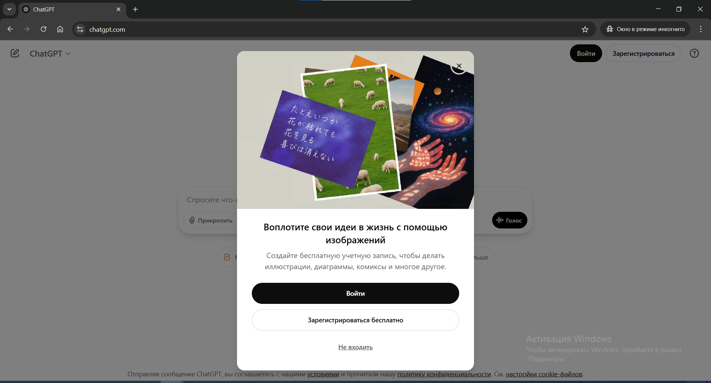

# Авторизация ChatGPT

На главной странице **[chatgpt.com](https://chatgpt.com)** ты видишь кнопку "*Войти*". Нажимай её

*Главная страница ChatGPT без авторизации*

## Вход через Google

В новой вкладке ты увидишь возможности авторизации. Тебе нужна кнопка **Продолжить с Google**

> ❗️ Не вписывай адрес электронной почты, а именно нажимай кнопку снизу **"Продолжить с Google"**

*Авторизация в ChatGPT*

В поле "Телефон или адрес электронной почты" укажи почту: `votetopovorot2015@gmail.com`

Пароль для аккаунта запроси у меня: [@botrqst](https://t.me/botrqst)

После пароля иногда требуется аутентификация. Напиши мне, и я подтвержу вход

В результате ты получишь доступ к аккаунту ChatGPT

*ChatGPT после авторизации*
