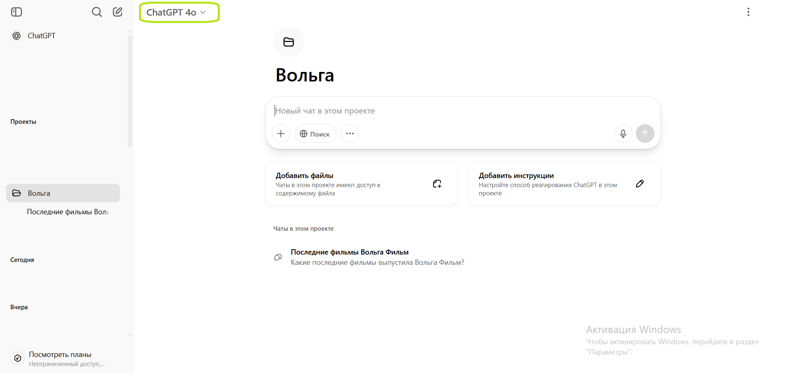
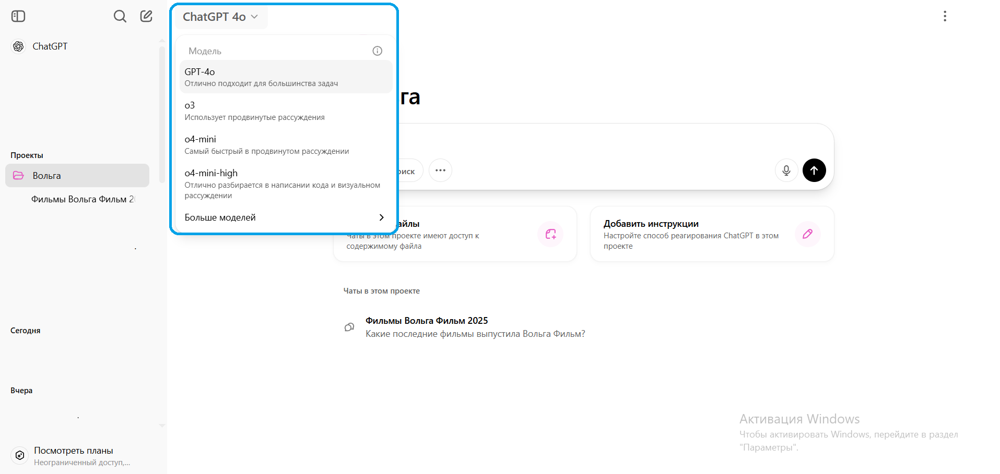
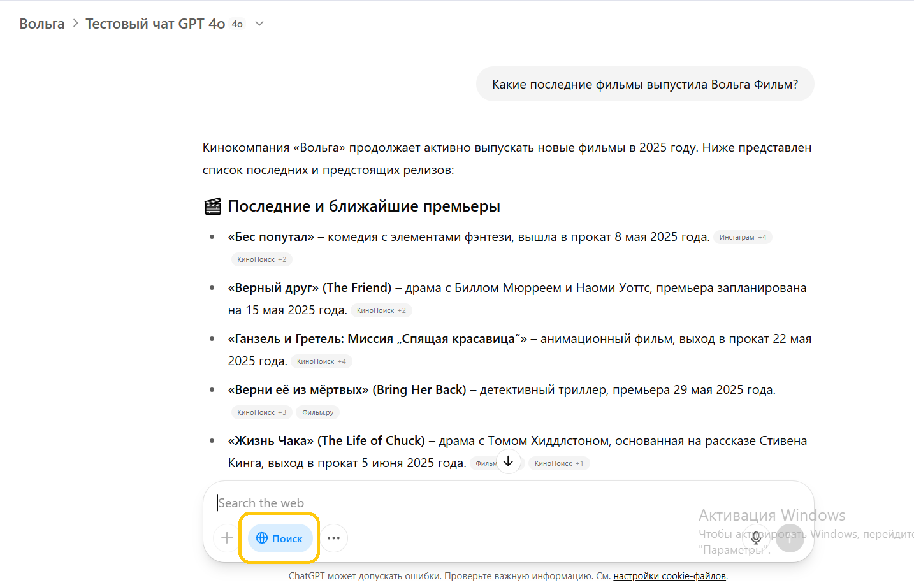
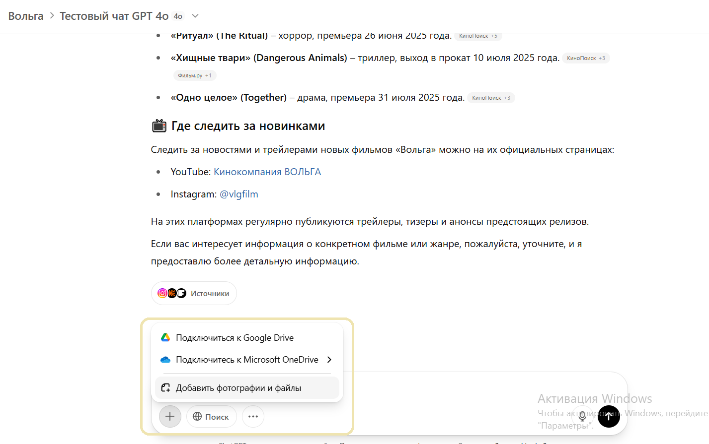
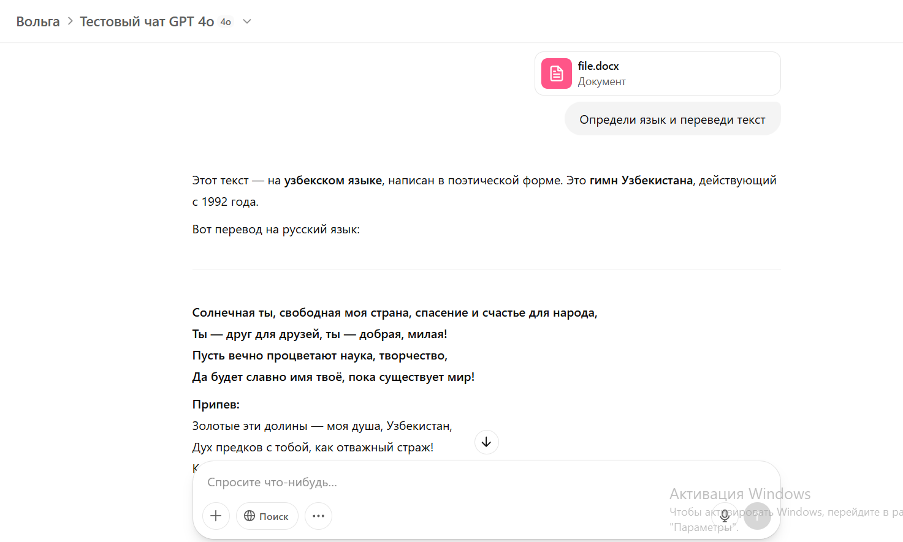
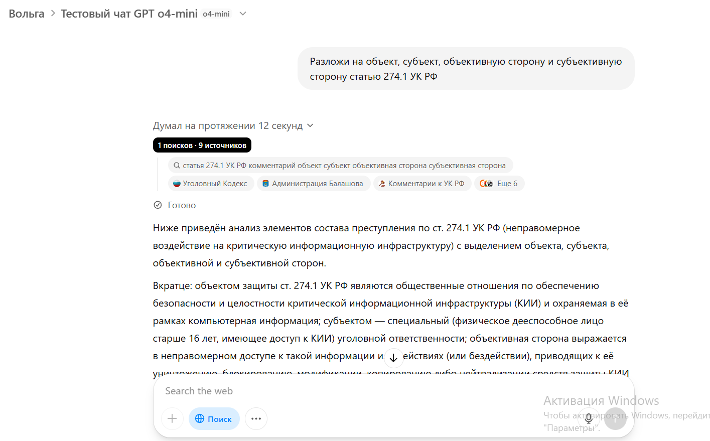
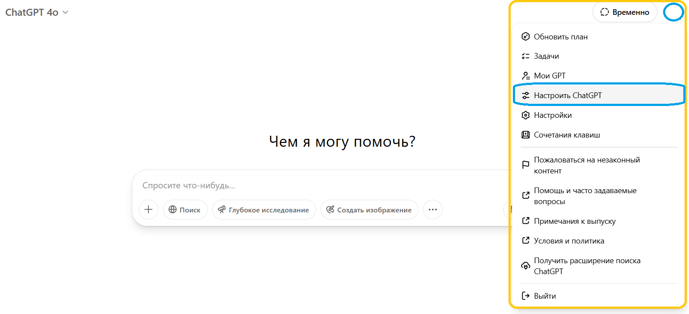

# Использование ChatGPT

## Твой проект

Проекты - собранные в одном месте диалоги с ChatGPT. Выбери проект **"Вольга"** - в нём ты можешь хранить все свои запросы к нейросети. 

*Проект "Вольга" в ChatGPT*

Диалоги и их история хранятся в проекте. Новые диалоги ты также создаёшь внутри проекта.

## Диалоги

Чтобы создать новый диалог, впиши свой вопрос и отправь его. Диалог автоматически создаётся, и ChatGPT начинает отвечать.

Ты можешь продолжить общение в любом чате. ChatGPT использует историю чата как контекст, чтобы точнее отвечать на твой запрос в рамках этого чата

## Модели и инструменты

Модель - тип языковой нейросети, который используется для генерации ответа. Модель указана сверху в левой части диалога

*Текущая модель диалога*

Нажми на значок модели, чтобы открыть меню выбора моделей

*Меню выбора моделей*

### ChatGPT 4o

Быстрая модель, генерирует ответ на лету. Может сама **гуглить**, чтобы лучше отвечать: для этого нажми кнопку "Поиск" перед отправкой сообщения

*Ответ с поиском по интернету*

Также GPT 4o может **обрабатывать файлы**. Для этого нажми плюсик рядом с кнопкой поиска, и выбери "Добавить фотографии и файлы"

GPT 4o хорошо работает с **переводами**: передадим ей файл с узбекским текстом, попросим определить язык и перевести на русский.

Модель хорошо справилась, ещё и правильно определила текст как гимн Узбекистана.

Для большинства повседневных задач можно использовать модель ChatGPT 4o 

### ChatGPT o4-mini

Умная модель, генерирует текст по аналогии с тем, как человек подбирает слова, опираясь на контекст. Ей нужно больше времени, зато она лучше решает **сложные задачи**. Она также умеет **гуглить**, когда ты нажимаешь кнопку "Поиск"

*Пример GPT o4-mini*

### Остальные модели

На аккаунте также доступны другие модели:

- **o3** - модель с размышлениями, которая работает медленнее чем **o4-mini**

- **o4-mini-high** - эффективнее работает с кодом и логическими задачками

- **GPT-4.5** - ограниченный доступ к модели, которая работает дольше 10-15 минут, ищет информацию по всем доступным источникам и даёт наиболее продвинутый результат 

- **GPT-4o mini** - устаревшая модель для быстрых ответов на простые задачи

## Формат ответа

ChatGPT поддерживает настройки, которые модели используют при каждом ответе. Нажми на значок аккаунта сверху справа, и выбери пункт `Настроить ChatGPT` 

В настройках я указал модели, что она должна отвечать профессионально, всегда начать с краткого саммари, не обращать внимания на лишние детали. Ты можешь обновить настройки для лучшего результата

