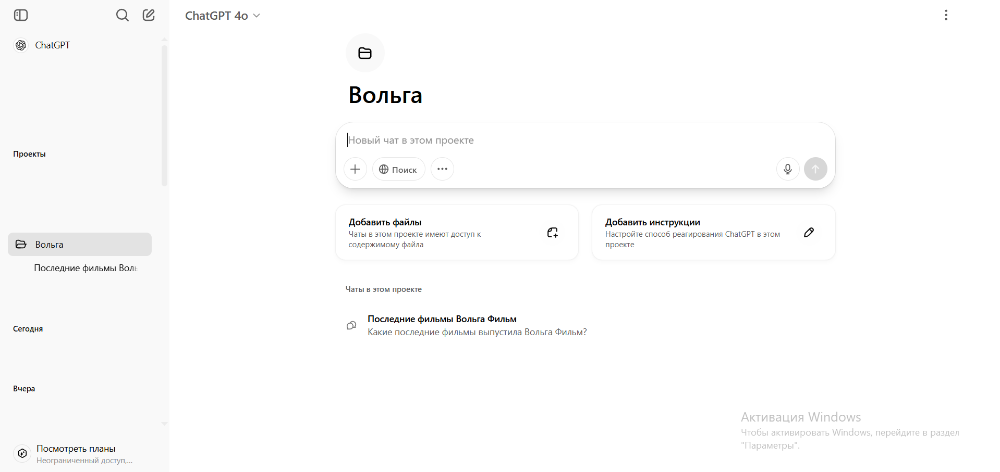

# Использование ChatGPT

## Твой проект

Проекты - собранные в одном месте диалоги с ChatGPT. Выбери проект **"Вольга"** - в нём ты можешь хранить все свои запросы к нейросети. 

*Проект "Вольга" в ChatGPT*

Диалоги и их история хранятся в проекте. Новые диалоги ты также создаёшь внутри проекта.

## Диалоги

Чтобы создать новый диалог, впиши свой вопрос и отправь его. Диалог автоматически создаётся, и ChatGPT начинает отвечать.

Ты можешь продолжить общение в любом чате. ChatGPT использует историю чата как контекст, чтобы точнее отвечать на твой запрос в рамках этого чата

## Модели и инструменты

Модель - тип языковой нейросети, который используется для генерации ответа. ...